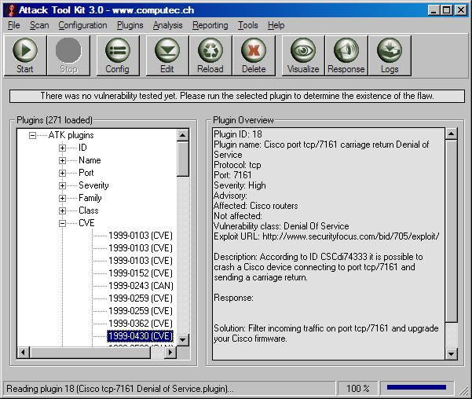



## Attack Tool Kit 3\.0

### Description

The Attack Tool Kit (ATK) is an open-source utility to realize vulnerability checks and enhance security audits. The most important changes in ATK 3.0 are the introduction of a dedicated exploiting routine and the Plugin AutoUpdate (over HTTP).
 
### More Info
 

             |
---                |---
**Submitted On**   |2004-11-14 08:29:32
**By**             |[Marc Ruef](https://github.com/Planet-Source-Code/PSCIndex/blob/master/ByAuthor/marc-ruef.md)
**Level**          |Advanced
**User Rating**    |5.0 (50 globes from 10 users)
**Compatibility**  |VB 6\.0
**Category**       |[Internet/ HTML](https://github.com/Planet-Source-Code/PSCIndex/blob/master/ByCategory/internet-html__1-34.md)
**World**          |[Visual Basic](https://github.com/Planet-Source-Code/PSCIndex/blob/master/ByWorld/visual-basic.md)
**Archive File**   |[Attack\_Too18187111162004\.zip](https://github.com/Planet-Source-Code/marc-ruef-attack-tool-kit-3-0__1-57240/archive/master.zip)

